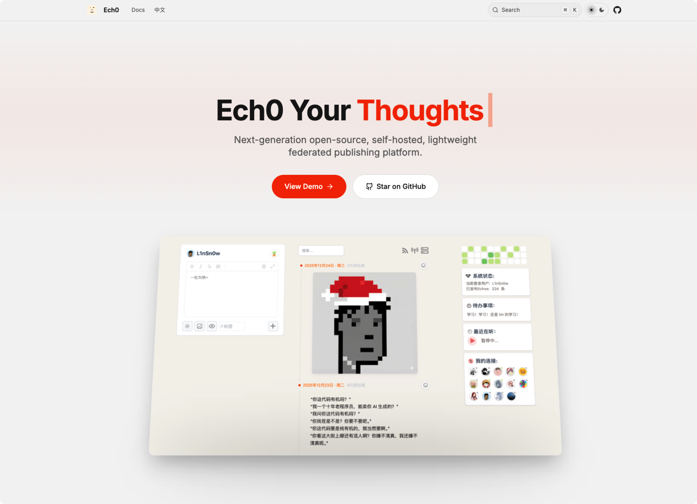
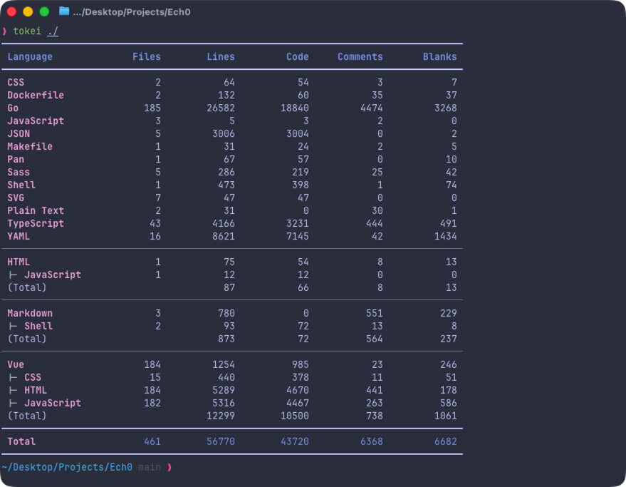
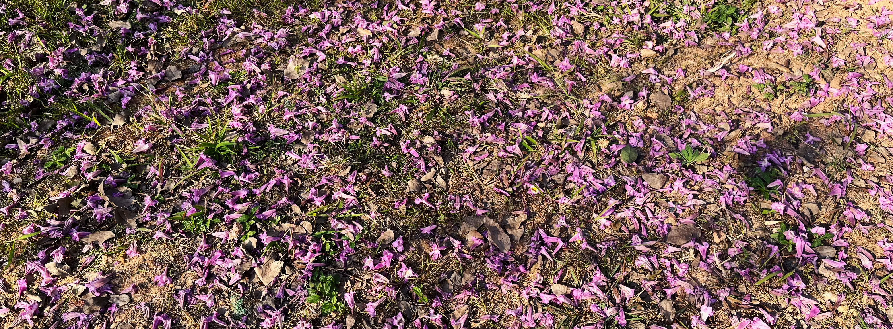
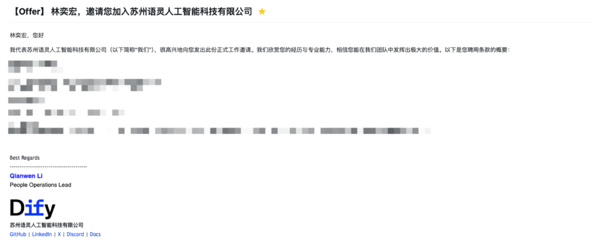
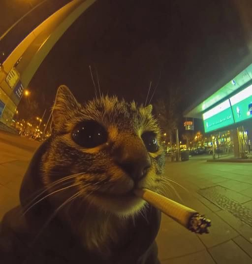
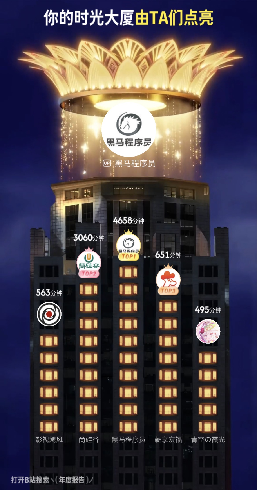
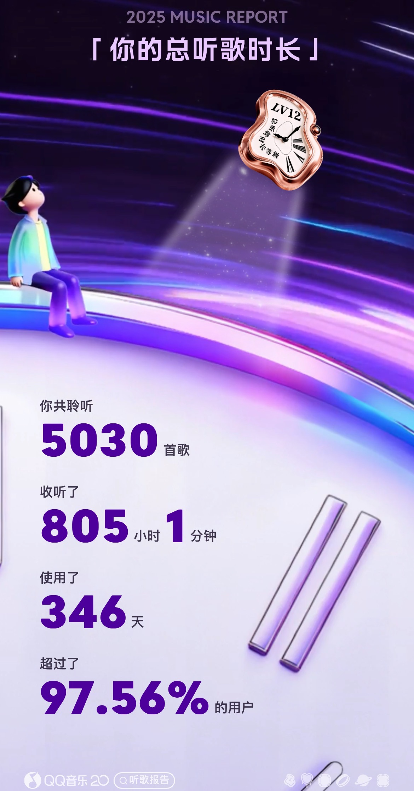
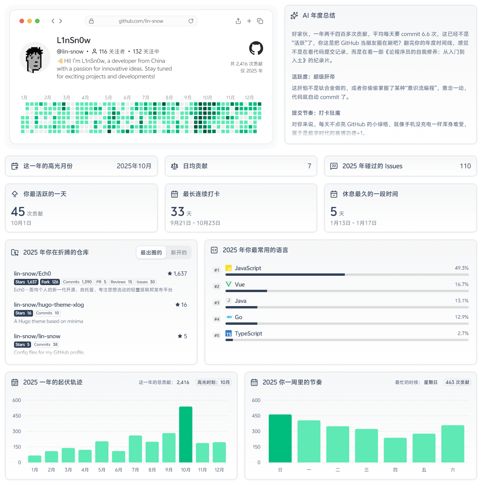
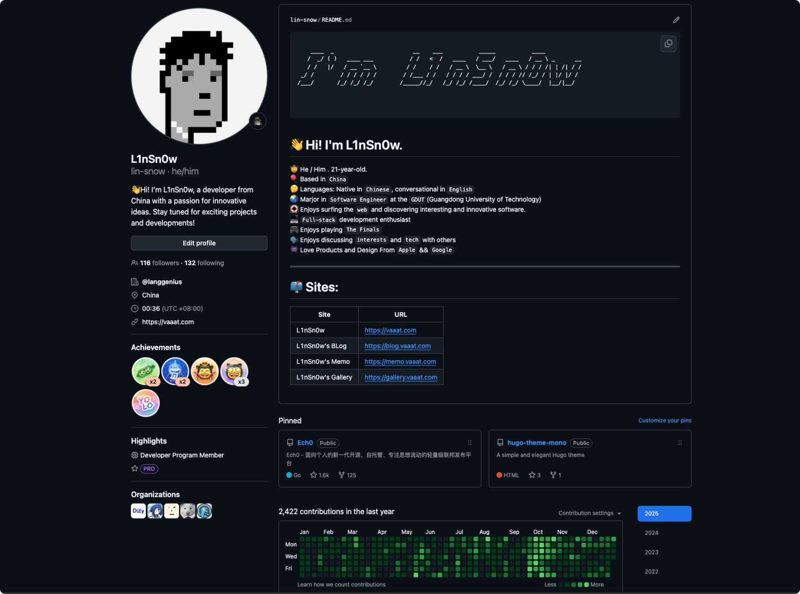

## 时间没有停下，我也没有

今天是 2026 年 1 月 1 日，回忆 2025，这一年充满了各种重大事件——**有意料之外的收获，也有计划之外的挑战。** 课程、项目、工作、技术探索、生活琐事，每一件事情都像是在悄悄改变着我的节奏。

**我会这么回答下面的问题：**

1. 2025 年，你朝着自己的目标努力奋斗了吗？  
**答**： 是的。我的 2025 年 没有懈怠，没有放弃，我一直在学习，一直在进步，一直在突破自我，也一直在寻找真的自我。

2. 2025 年，你有什么遗憾吗？  
**答**： 仔细想了想，遗憾谈不上，应该只能算是不如意吧，不过无伤大雅...

3. 2025 年，上一年也就是 24 年画的饼是否都实现了？  
**答**：也许都实现了吧 qwq .完成情况如下👇
- [x]  深入学习后端相关技术栈（如Spring、Spring Boot、Spring Cloud等）
- [x]  掌握React前端框架
- [x]  开发至少两个以上的大型前后端项目
- [x]  拍出更多自己满意的照片
- [x]  …

---

## AI 和我

从 23 年 GPT 的火爆出圈到现在，AI 是一个无法绕开的话题。2025 年，AI 的广泛应用为我的学习和工作带来了全新的范式。AI 爆火的这两三年里，AI 相关技术快速迭代，日新月异，各种各样的 AI 产品层出不穷，AI 正在以一种前所未有的方式对我的生活、学习和工作进行革命，**我现在已然无法想象没有 AI 的生活将会是什么模样**。

这一年，**我积极拥抱和尝试各种 AI 工具，并将其融入我的 Coding 工作流中的几乎每一个环节**。
虽然 AI 目前还没有达到真正的全知全能，但已经足够帮助我实现许多过去无法想象的想法，也让我快速将许多知识与零散的学习碎片转化为可沉淀的能力，让知识真正被理解和内化。

所以，我想下面的 AI 工具表示感谢，希望它们能够同我不断进步：
 1. 首先感谢的必须是 ChatGPT ，虽然我没有 Plus 和 Pro 的订阅，虽然 ChatGPT 有时候没有别的 AI “聪明”，**但是绝大多数时候，它总能快速地给出满足我需求的响应**， "有问题找 ChatGPT" 早已成为我的习惯！
 2. 其次我要感谢集成在 VSCode  里的 Github Copilot，虽然它比不上 cursor 强大的模型，但是Github Student Pack 使我这种**穷学生也能免费用上 AI IDE** 来完成许多繁复的任务，大幅提高了编码的流畅性。
 3. 最后就是 Google Gemini，虽然用的没有前两者多，但是有些时候 ChatGPT 解决不了的问题还是得问问 Gemini 大哥的想法，**有时候确实能给出出乎意料的可靠答复**。

一人配上几名 AI 大将即可成军！相信这场 AI 革命必将带来更多好玩好用的工具！

---

##  Ech0 和我

:::gallery

:::

> Ech0 —— 面向个人的新一代开源、自托管、专注思想流动的轻量级联邦发布平台

先说说 Ech0 的前世今生吧。Ech0 最早是从2025 年三月份的时候开始创建开发的，那时候的想法很简单——用 AI 和 Gin 做一个究极简单的公开留言板**作为学习 Golang 和 AI 的练手项目**。但是随着用户的不断反馈，我开始不断完善这个项目，在开发的过程中，我的心态也渐渐发生了转变，我开始重视这个项目，我想这次我要把属于自己的第一个项目真正做好。于是我**开始调研市面常见类似产品，开始思考产品定位，开始不断了解用户需求，开始不断询问自己想要一个什么样的产品**，我几乎把课内课余绝大部分时间都投入到了 Ech0 的开发里，期间不断地重构，重写，不断地学习新技术来实现用户和我的需求，就这样一直持续到现在，我想我基本上做到了：
- 从产品方面： Ech0 已经基本上实现了我和用户提出的绝大部分的需求，并且产品定位也越来越清晰，在同类型产品里拥有独特的优势与竞争力。
- 从数据方面：Ech0 在 Github 上已达到 1.6k Star, Docker Hub 下载量超 10k。
- 从设计理念方面：Ech0 的核心设计理念始终没变。
- 从社区方面：Ech0 吸引了十几位小伙伴一起参与贡献与社区的治理，同时还有好几位好心宝宝慷慨的给予项目打赏！**（在这里再次表示感谢你们所有人！）**
- ......

Ech0 作为我今年付出最多的项目，它是我大半年来技术和成长的记录者和见证者！

2025 年 12 月 14 日，我在 porkbun 买下了 **Ech0.app** 这个域名，Ech0 正式拥有了一个符合品牌形象的独立域名！~~虽然官网和文档还不够完善，我会尽力补上优化的()~~

**看到大家能够用 Ech0 记录和分享，能给帮助到有需要的人，我已经非常开心和满足了，或许这就是 Ech0 最大的价值吧！**

---

## 亲情、友情

2025 年，在社交方面，我依然还在探索中，这一年我保持着一种**极为开放**的交友心态，同时也在审视以往的一些交往模式。**我经常在想，我是否忽视了某些人，又或者我是否对他人过于热情。** 也许在社交上我仍有许多无知与不足，但我希望自己能更早地意识到这些问题，并不断改进，让交往变得更真诚、更自然。~~哎，本 INFJ 尝试把自己驯化为 ENFJ~~

**这一年里，我认识了许多线上的朋友，是他们陪着我度过许多个平淡的日夜！陪我做完了许多件有趣的事情，很荣幸能遇见你们，期待新的一年里还能够和大家继续加油！**

相比之下，线下结识的新朋友并不算多，但我依然珍惜那些为数不多、却足够真诚的连接。它们提醒我：**社交的价值并不取决于数量，而在于是否能够让彼此感到被尊重、被理解。**  
或许在社交这件事上，我依旧谈不上成熟，但至少在 2025 年，我开始更认真地对待“如何与他人相处”这个问题，这本身就是一种进步。

2025 年，在亲情方面，我取得了明显的进步。我不再将一天的时间毫无区分地分配给所有事情，而是开始有意识地为家人预留空间。有机会的时候，我会主动抽出时间与父母聊聊天，哪怕只是一些看似琐碎的日常，也比以往更耐心、更专注。

这种改变并不源于某个具体的事件，而是一种逐渐清晰的认识：**很多关系并不会因为距离而自然稳固，它们同样需要被认真对待。** 过去我总是把“忙”当作理由，把关心留在心里，却忽略了表达本身的重要性。

这一年里，我开始学着把情绪说出口，把关心落实在行动上。虽然依旧做得不够好，但至少不再回避。亲情不需要刻意经营成某种仪式，它更多存在于一次次主动的联系与回应之中。

---

## 实习！实习！

2025 年 9 月，我正式踏上了寻找实习的道路。对我来说，这并不是一个轻松的决定。作为一个在表达、社交与自我推销方面并不占优势的 I 人，投递简历、参加面试本身就需要反复鼓起勇气。但我很清楚一件事：**实习是计算机专业无法回避的一道关卡，也是将“学习”转化为“实践”的必经路径。**

在这一过程中，我逐渐意识到，找实习考验的并不仅仅是技术栈的熟练程度，更是一种综合能力的暴露——包括对自己过往经历的梳理能力、对问题的拆解能力，以及在不确定中持续行动的耐力。很多时候，挫败感并非来自“不会”，而是来自对自身定位的不清晰。

随着投递与面试的推进，我开始更理性地审视自己的优势与短板。一方面，我看到了自己在基础能力与学习速度上的不足；另一方面，也第一次明确感受到：长期积累的项目经验、对系统性问题的思考，并非毫无价值。实习并没有立刻给我一个确定的结果，但它迫使我提前进入了真实世界的评价体系。

非常幸运的是，在朋友的内推下，经过三轮面试，我最终加入了 **Dify.AI**。截至今天，已经是我入职的第 45 天。**感谢公司与同事们对我的信任，也感谢这个团队提供了一个足够真实、足够开放的环境，让我得以参与到实际业务与工程实践中。**

这段实习经历让我更直观地认识到：**工程并不仅是把代码写出来，而是一系列关于协作、取舍、责任以及长期可维护性的综合判断。** 在 2026 年，我期待在不断提升自身能力的同时，能够将学习与实践转化为对业务与系统有实际意义的产出，为 Dify.AI 的发展贡献自己的一份力量。

---

## 焦虑没有消失

尽管这一年我在学习、工作和生活中都有所收获，但焦虑感依然如影随形。每当面对新的任务、未知的挑战，或者对未来的不确定时，那种紧张和不安依然会出现。焦虑并没有完全消失，它只是以一种**更为隐秘、可控的方式**存在着——提醒我保持警觉，也推动我去解决问题。

不管是在学习、生活和工作等各个方面，隐蔽的焦虑贯穿我了一整年，有时它让我身心俱疲，有时它成为推动我不断进步的动力。

我渐渐意识到，焦虑本身并非敌人，它是一种信号，告诉我哪些地方仍需努力，哪些问题尚未被妥善处理。与其试图完全消除焦虑，不如学会**与它共处**：接受它的存在，同时让行动去缓解它，让计划和执行成为应对不确定性的武器。

这种微妙的平衡，让我在面对压力时不再慌乱，而是更加冷静地去思考和安排下一步的行动。焦虑仍在，但它不是阻碍前行的绊脚石，而是提醒我不断自我提升的动力源。

---

## 赛博年度回顾

2025 年，我想分享我在一些主流平台里的年度报告。
首先要感谢 B 站大学和各位赛博菩萨在这一年给我提供优质免费的学习资源，这对我们这种穷学生真的很重要！  
其次是 QQ 音乐，丰富的音乐和优秀的推荐算法，不管是日常 Coding 、运动，或者是偶尔心情低落的时候，打开 QQ 音乐听歌都是一个不错的选择！

:::gallery

:::

在游戏方面，**同 23、24 年一样，《The Finals》 依然是我心中毋庸置疑的 Top1！**（这一整年里我几乎只玩 The Finals ）。从夯到拉排的话必须给到夯爆了！

在 Self Host 方面，我现在仍保留和使用的自托管程序仅剩下：
- [Ech0](https://github.com/lin-snow/Ech0) —— 面向个人的新一代开源、自托管、专注思想流动的轻量级联邦发布平台。
- [chronoframe](https://github.com/HoshinoSuzumi/chronoframe)—— 丝滑的照片展示和管理应用。

在建站方面，我目前主要使用 vaaat.com 作为我的主域名，现有网站如下：
- Home Page：[vaaat.com](https://vaaat.com)
- Blog：[blog.vaaat.com](https://blog.vaaat.com)
- Micro Blog：[memo.vaaat.com](https://memo.vaaat.com)
- Gallery: [gallery.vaaat.com](https://gallery.vaaat.com)

在 Coding 方面，我是 Github 的忠实用户，**感谢 Github 平台与强大的社区支持**，它为我的学习和项目提供了稳定而高效的环境。下面是 Github 年度使用总结：

:::gallery

:::

---

## 关于下一步

站在 2026 年的起点，按照惯例，我先画点饼：
- [ ] 深入学习 Kubernets，掌握更多云原生技术栈
- [ ] 深入学习 Golang 和算法，提高自己的代码能力
- [ ] 巩固所学知识，做到熟练使用
- [ ] 开发一个大型项目
- [ ] 增强自己协作和解决问题的能力
- [ ] ...

---

## 写在这里

2025 年，充满各种挑战与变数的一年。感谢 2025 年的自己，愿意花时间学习、尝试、反思，也愿意在迷茫中继续向前。    
时间不会停下，我也不会。    
希望在未来的某一天回看这一切时，依然能对今天的选择感到坦然。  

> "别害怕走得慢，愿你在一步一脚印的前行中，仍能感受到世界对认真之人的回应。"