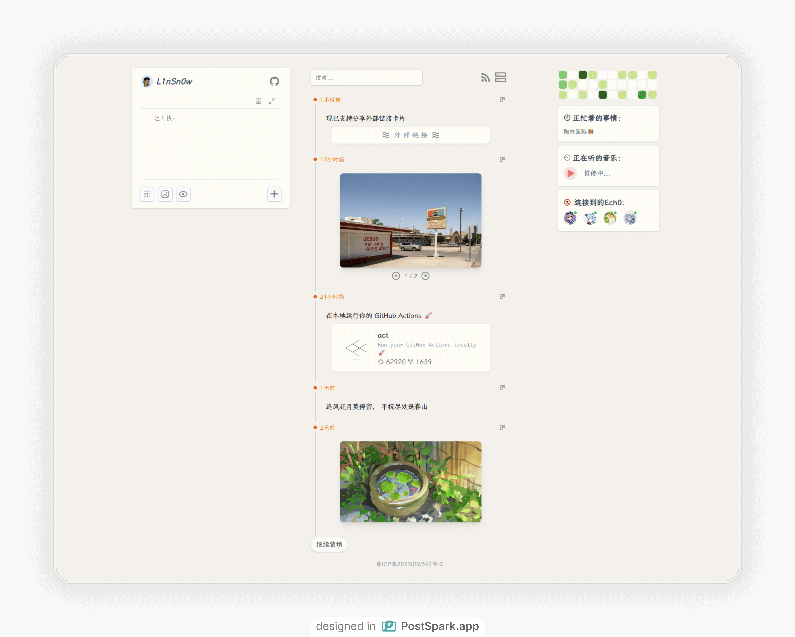
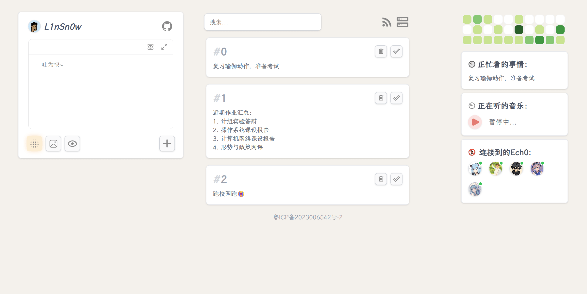
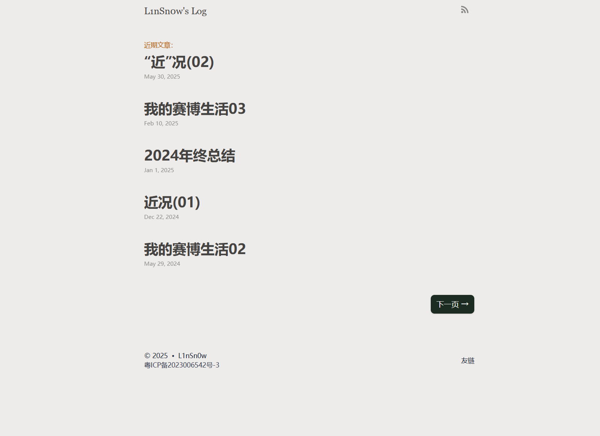
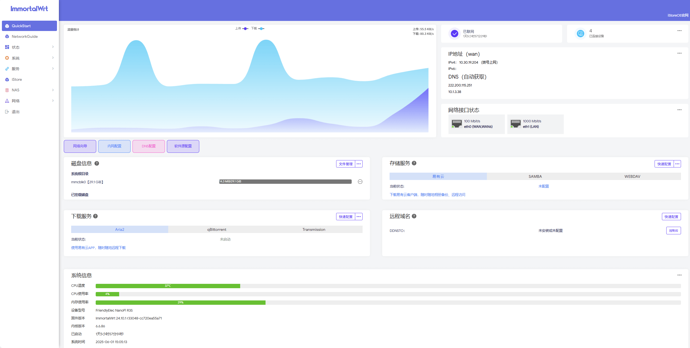
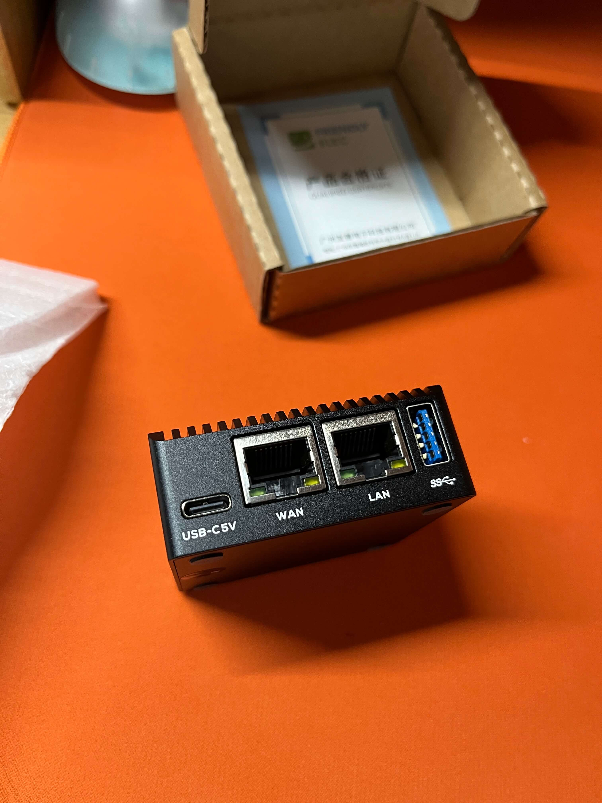
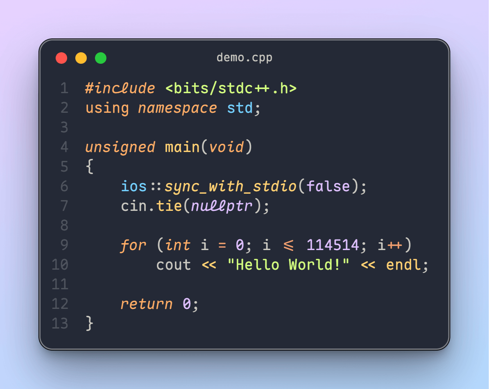
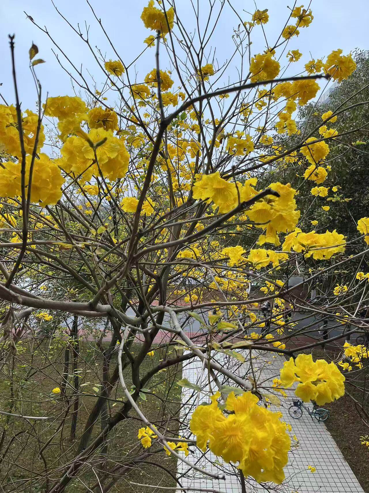

哎，好久没写博客了。。。一年的时间真的很长吗？2025年转眼已经过去了一半，直到今天，算上这篇总共才发了两篇，而我能找到的借口也只剩下“忙”了，但是**我真的在坚持写博客吗？** 我也不知道。这次我想记录点近况，但是这不是真的最近，有些内容已经是两三个月的时间跨度了，所以我的标题给近打了双引号，一是**攒了一些水文章的素材**，想记录下来，二是为了**证明我的博客还活着**（）

---
## 网站重构
是的，我又对网站进行了重构，并且这次对比上次，我进行了更多的修改，同时也有了更多的思考。
为什么重构呢？一方面是因为我现在拥有了两个新域名，二是因为我的网站数量越来越多了，管理起来比较混乱，所以我选择了重新整理各个域名的分配和作用。
而原先的`linsnow.cn`，我选择了抛弃并取消续费，只保留我现在的`vaaat.com`和`soopy.cn`，因为从cn换到com会使我每年的续费费用变得更高，而且两个域名已经足够我使用了，抛弃掉一个可以让我省点米，留下的这两个新域名都比抛弃掉的域名更短，而且更容易记忆和输入，我还是更喜欢现在的两个域名（可恶的坏男人，总是喜新厌旧）。
这次我的重构内容主要是按照**网站的服务对象**进行了划分，分为**个人自用网站**和**项目网站**。
以下是我的重构后的网站结构：

**个人自用网站：**
1. 主页：vaaat.com
2. 博客：log.vaaat.com
3. 说说：memo.vaaat.com

**项目网站：**
1. 项目汇总：soopy.cn
2. 项目1官网（Ech0）：echo.soopy.cn

这里面大部分站点我都选择了静态网站，选择静态网站的好处不用多说，重构的博客框架我依然选择了`Hugo`，而主页和项目汇总官网则使用了`Astro`（这个框架提供了很多精美的Theme,拿来建站真是又快又好看）。

---
## Memo(s?)
memos是一款强大好用的自主部署web软件，但是这也是我重构网站的一环，我停掉了我之前部署的memos站点，一是现在的memos和我之前刚接触的memos已经越来越不一样了，它已变得**不再是我以前喜欢的样子**，二是对于一款发展壮大的软件，或许**很难去满足每个人的胃口**吧，而我也很少在memos上发布说说，因此我干脆就把memos给停掉了。不过**关掉Memos并不代表停止Memo**，是的，我为自己打造了一款**符合自己设计审美和需求**的软件——**Ech0**

---
## Echo But Ech0

开发Ech0并**不需要很高的技术要求，更多的是对于软件界面设计和功能的权衡**，这花费了大量的精力，期间也重写了整个前端，从Nuxt 和 NuxtUI换到了裸vue3,当然重写前端是非常重要的，相比原先的屎山，重写后的前端对于后续的开发、维护和扩展等都发挥着巨大作用。

整个开发过程我遵循着**先取悦自己，再服务自己，最后兼顾他人**的原则，具体展开来说，取悦自己首先是我在开发这款产品的过程所带来的快乐，这让我沉迷其中，这也一直是我学计算机的一个主要动力，那就是亲手实现自己的创意和想法！而服务自己则是满足自己的使用需求，这也是最基本的，最后的兼顾他人是与他人交流软件的改进点和看法，尽可能的去满足他人的使用需求，同时不导致软件变成自己的讨厌的模样（比如臃肿等），这里要**非常感谢提供改进建议的群友**，这些建议让Ech0与最初的设计发生了巨变，bug也减少了非常非常多，没有这些建议和反馈，Ech0无法快速的向前推进！
在我写下这篇文章的时候，Ech0已经趋于稳定并且希望实现的功能也已经大部分完成，在稳定使用了一阵子后，我想把分享出来，希望会有人喜欢，也希望能得到更多的反馈和建议，这对Ech0的改进很重要。

**一些Ech0的Feature：**
- ☁️ **原子级轻量**：内存占用、可执行文件、镜像大小均不到**30MB**，单SQLite文件存储架构
- 🚀 **极速部署**：无需配置，从安装到使用只需1条命令
- ✍️ **零干扰写作**：纯净的在线Markdown编辑器，**支持丰富的Markdown插件与预览**
- 📦 **数据主权**：所有内容存储于本地SQLite文件，支持RSS订阅
- 🎉 **永久免费**：MIT协议开源，无追踪/无订阅/无服务依赖
- 🌍 **跨端适配**：完美兼容桌面/移动浏览器，支持手机、iPad、PC三端响应式布局
- 👾 **WPA适配**：支持作为Web应用安装
- 📝 **内置Todo管理**：轻松记录、管理每日待办事项，帮助你高效规划和追踪任务进度
- 🔗 **Ech0 Connect**：全新内容聚合与互联功能，支持多实例间互通、内容订阅与同步，打造属于你的去中心化内容网络
- 🎵 **无缝音乐集成**: 内置超低资源占用的音乐播放器，支持本地音频流解析，提供沉浸式背景音乐与专注模式
- 🎥 **即时视频分享**: 原生支持哔哩哔哩视频智能解析，输入BV号/链接即可自动提取并嵌入
- 🃏 **丰富的快捷卡片**：支持网站链接、GitHub项目等多种富媒体内容一键分享，让信息展示更加直观生动
- ⚙️ **高级自定义功能**：为高级用户提供便捷自定义样式与脚本，分享更具表现力

>  开源仓库： [lin-snow/Ech0: Ech0 - 开源、自托管、专注思想流动的轻量级发布平台](https://github.com/lin-snow/Ech0)  
>  官网传送门： https://echo.soopy.cn/  
>  预览地址： [L1nSn0w's Ech0](https://memo.vaaat.com/)

---
## Tika还活着吗？

在大二上的寒假，我开发了**Tika —— 一款简陋的Todo半成品**，TODO类软件几乎是每个独立开发者都不会绕过的活，我也不例外。在大二下开学后的一段时间里，我确实使用了一阵子Tika,但是我发现，我只是单纯的把很多待办事项罗列了上去，它几乎变成了某种意义上的备忘录，在罗列完待办事项后我几乎就没打开过了，**这里有一个有意思的事情，就是很多事项几乎无法短时间内完成，而短时间内完成的事项在完成后却需要你频繁的去打开软件进行记录和Mark Done**,我不认为这是一个好的Todo软件或者好的使用方式，相反这可能带来一些额外的效率下降。更糟糕的是，对于一个半成品纯网页app，它不能像手机app一样自然的使用，也没有完善的截至日期通知，因此,**我停止了Tika的使用，并对仓库进行了归档**。

“Tika已死，Tika永生！“  好吧，我想说的是**停止使用Tika并不代表我没有记录Todo的需求**，我在上面的提到Ech0里加入了类似Todo的功能,这一次，我希望尽可能的简单，简单到只能使用纯文本记录最多三条代办事项，仅此而已，没有截至日期，记录下的todo可以删除或者Mark As Done。并且默认展示三条todo中优先级最高的一条于首页，现在它**更多的是备忘**，而最多三条todo的限制使得你不得不考虑当下最该被完成的事情，而不是一股脑全不添加上去，是的，**记录短期的Todo而非长期的**！
也许在使用足够长的使用时间后，我**才能验证这种设计对于我是否有效**，这放在我以后的文章里在聊吧（没忘记的话）。

---

## MINI And mini - Mono

博客同样也是我网站重构的一环，这次我依然选择静态网站生成工具 `Hugo`,而主题则使用了我最新写的`Hugo-Theme-Mono`。回顾我的Hugo建站历程，从`Hugo-Theme-Stack`到`Hugo-Theme-Xlog`,再到`Hugo-Theme-Mono`，这三次更换都有着共同的特点，就是朝着**精简**的方向前进，而这次我希望一步到位，采用**极致精简的设计**，同时保持文章能够无损适配三款主题随意切换迁移。

对于Hugo-Theme-Mono这款主题，我只保留了我认为必要的RSS、文章、友链和评论功能，并且评论使用了**基于GitHub Discussion的giscus**,这让评论功能的部署成本变得极低。

对于任何博客主题，它最重要的服务对象应是markdown形式的文章，不管主题功能如恶化丰富或者花哨，都应该**把文章内容的展示和阅读体验放在首位**，其它只是锦上添花（当然这里的话可能要打双引号）。

因此在设计Hugo-Theme-Mono的时候，我希望它能够**尽可能地被无感使用，尽可能地让你不去在hugo本身，而是专注于markdown文章的编写与管理**，这是我所希望的。
当你阅读这篇博客的时候，是我更换到新主题的第一篇博客，希望你的阅读体验能有所提升（也许）。

---
## 内包外包
大二上这学期，我在一个**要好的高中朋友**那里接手了一个全栈外包项目，从项目的原型设计到最后的开发和交付上线，全程参与，与我的另一个要好的盆友我们两人一起共同完成，或许外包的能赚到的钱并不算很多，但是对于一个大学生，这也已经达到我的预期了。
我想，**做外包项目能带来的不止是实际的金钱利益，同时也能够提供一定的实践经验，这是我想要的**。
外包签了合同，好在最后也是顺利按时完成了交付，这也是我第一次靠自己的技能和双手拿到了人生第一桶金！

---
## 我和母亲节
**时间很巧，在母亲节到来的前一天，我刚好也拿到了外包的尾款**，外包全部加起来总共到手1400元！这一次的母亲节，对于我来说，有着不一样的意义！因为这是我第一次能够真正的靠自己赚到钱给母亲发1314的转账，**我知道冰冷的钱或许比不上更加实用的礼物，但是我想更重要的是温暖的亲情！** 或许这就是人们常说的礼轻情意重吧。
**也许避免“树欲静而风不止，子欲养而亲不待”的最好方式就是从现在开始！**

---
## 圈钱杯
蓝桥杯还是那个蓝桥杯，**由于我太菜了，只拿到了省三，没能值回票价**，嗐。但是不管怎样，我还是要吐槽一下圈钱杯的作弊现象，甚至车队都整上了，而且报名了的人也无法退款退赛了，难评...我只能说耗子尾汁！

---
## R3S软路由

在我的赛博生活03那篇文章里，我成功让路由器AX3000T刷上了ImmortalWRT,但是这依然无法满足我更高的上网需求，原因主要**在于路由器本身的内存太小，导致插件频繁的爆内存死机**，这严重影响使用体验。因此，最终我不得不入手了性能和内存更加强大的R3S！
**刚拿到R3S后真的很惊艳，小巧的金属外壳机身充满质感**，刷上WRT也非常的轻松，网上有非常多现成的编译好的WRT,比如iStoreOS、LEAN专门适配好的R3S固件和ImmortalWRT官方编译的固件等。
最终我选择了官方编译的ImmortalWRT 并搭配istoreOS的包，嘎嘎稳定好用！最后晒一晒我R3S的美照！（超级精致好看！！！）

:::gallery

:::

---
## 编程字体Maple
我又又又给我的VSCode换了新的编程字体，这次的编程字体Maple真的是一见钟情，强烈安利给任何人（我们颜狗是这样的）。
代码虽然写的很烂，但是编辑器一定要搞的漂漂亮亮的！
这里晒一张刚上手这款字体时拍的美照。

> Maple 开源仓库地址： [Maple Font](https://github.com/subframe7536/maple-font)

---
## 给代码拍照
双喜临门，开发这款编程字体的作者同样开发了一款VSCode代码截图工具，不仅可以给代码截图，也能给终端截图，使用效果可以参考上面发的代码截图！
代码配上好看的字体，下一步自然是配个好用的代码截图给代码拍美美的照片啦！下面给出插件的开源仓库地址，快去使用吧，觉得好用的话不要忘了给插件开发者点个star!
> 仓库开源地址： [VSCode-Codeimg](https://github.com/subframe7536/vscode-codeimg)  
> 插件安装地址： [CodeImg - Visual Studio Marketplace](https://marketplace.visualstudio.com/items?itemName=subframe7536.codeimg)

---
## 给生活拍照
优美的代码直接被记录分享，生活也是一样，这学期的忙碌使得我很少拿去手机去记录和拍照，但是我依然在闲暇时光里捕捉了一些值得分享的镜头。
三张图片分别拍摄于：1. 宿舍楼顶 2. 广州珠江附近 3. 校内图书馆附近的草地 4. 教学楼附近的树 5. 傍晚的教学楼楼梯

:::gallery

:::

---
## GitHub清理
以前不懂事，遇到好的仓库就随手点了fork,最后越攒越多，导致Github里有一堆空的仓库和不使用的仓库，看着Github上五十多个仓库总感觉很膈应，于是我清理了一波仓库，把大部分空仓库和没用的仓库给删除了，一些已经停止维护的仓库则进行了归档处理，最终清理了二十多个仓库，爽！

---
## 回顾-NAS
2024年5月20日购买的极空间，到如今已经默默陪伴我整整一年。在这一年的时光里，它始终运行稳定、表现出色。最初装入的那块4T硬盘，如今依然剩余1T可用空间，足以应对未来一段时间里不断增长的照片与视频文件。

作为一台NAS，我在初购时就希望**它不仅仅是一个简单的文件存储工具，更是我生活与记忆的守护者**。我的日常拍照、旅行记录，它都能够妥善保存。

如今，这台NAS中已经存储了大量电影与电视剧，成为我与家人共享时光的娱乐中心。同时，我大学两年间的所有照片和视频，也都已妥善备份于此。**这些数据看似冰冷，却承载着我最温热的记忆**——校园的花草、夜晚的星空、努力与青春的痕迹。

时间从不为谁停留，也许在多年之后，当我再次打开这台NAS，映入眼帘的将是我大学四年一点一滴的生活片段。那一刻，它不仅是一台网络存储设备，更像是一座时光的容器，为我守护着曾经的青春与故事。**这或许就是数字化时代赋予我们的温柔——让记忆得以永久珍藏，让过往得以再次相见。**

---
## 清澈愚蠢的大学生
人们常说“清澈愚蠢的大学生”，而我却是那个“愚蠢的大学生”。
上大学后，我选择了计算机专业。从那时起，我的生活便被宿舍、食堂与教学楼这三点构成了闭环。**没有课程的日子里，我几乎整日待在宿舍电脑前，不是在游戏中消磨时光，就是独自学习、敲代码、看教程。这样的日子虽然规律，却也逐渐让我与外界隔绝。**

我几乎没有参与社团活动，也几乎没有太多社交。在别人热衷于组织、参与、表达自己的时候，我总是默默地坐在一旁，习惯了独处，也慢慢习惯了沉默。久而久之，在与人交谈时，我变得拘谨，词不达意，甚至常常因为紧张而语塞。

**或许这就是大部分程序员宅男的“下场”吧，我也不知道如果一直这样下去，未来的自己会变成什么模样。**

---
## 思考碎片
最后......好吧，本来想写一些思考碎片，但是,.......

>"别着急成长为一个完美的人，愿你在缓慢前行的路上，也能坚定地相信自己值得被世界温柔以待。"
